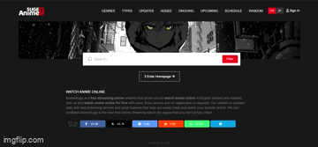

# AnimeSurge UI Clone 🎬

This project is a clone of the AnimeSuge user interface, built using HTML and Vanilla CSS. It was created as a learning exercise to practice the fundamentals of web development. 💻

## Screenshot 📸



## Deployed Link :

The website is hosted at : 👉 [AnimeSuge Clone](https://animesuge-clone.vercel.app)
 
## Table of Contents

- [Project Structure](#project-structure)
- [Technologies Used](#technologies-used-)
- [Deployed Link](#deployed-link-)
- [Description](#description-)
- [Features](#features-)
- [Screenshot](#screenshot-)
- [Getting Started](#getting-started-)
- [Usage](#usage-)
- [Contributing](#contributing-)
- [Acknowledgments](#acknowledgments-)

## Project Structure

- **index.html**: The main HTML file representing the home page.
- **style.css**: The CSS file containing the styles for the page.

## Technologies Used 🛠️

- HTML
- CSS

## Description 📝

The AnimeSuge UI Clone is a static website that replicates the design and layout of the popular anime streaming platform, AnimeSuge. It aims to provide a similar user experience as the original website, with a clean and responsive interface. 📱💻

## Features 💫

- Navigation menu for easy access to different sections
- Anime heading picture
- Footer with additional information

## Getting Started 🚀

To run the project locally, follow these steps:

1. Clone the repository:

```
git clone https://github.com/AryanBhati7/AnimeSugeUI-Clone.git
```

2. Navigate to the project directory:

```
cd AnimeSugeUI-Clone
```

3. Open the `index.html` file in your preferred web browser.

## Usage 🔍

Once the website is open, you can navigate through the different sections using the menu or by scrolling down the page. The search functionality is currently limited to the front-end and does not perform actual searches.

## Contributing 🤝

As this project was created for learning purposes, contributions are not accepted at the moment. However, feel free to fork the repository and use it as a reference or for your own learning journey.


## Acknowledgments 🙏

- The design and layout inspiration came from the official AnimeSuge website 👩‍💻
- You can check them out at : [AnimeSuge](https://animesuge.to/) 🌐
- Thanks to Vercel for their easy deployment service 🚀
- Thanks to Shradha Mam and Alpha College for their great tutorials 😊