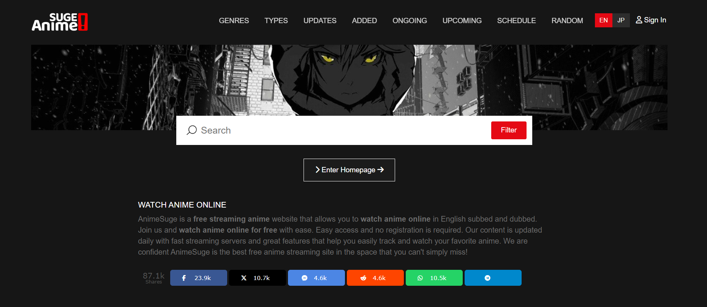

# AnimeSurge UI Clone 🎬

[AnimeSurge UI Clone](https://github.com/AryanBhati7/AnimeSurge-Clone) 🌐

This project is a clone of the AnimeSurge user interface, built using HTML and Vanilla CSS. It was created as a learning exercise to practice the fundamentals of web development. 💻

## Technologies Used 🛠️

- HTML
- CSS

## Deployed Link :

👉 https://animesurge-clone.vercel.app/

You can check out my clone at the link provided above. 👆

## Description 📝

The AnimeSurge UI Clone is a static website that replicates the design and layout of the popular anime streaming platform, AnimeSurge. It aims to provide a similar user experience as the original website, with a clean and responsive interface. 📱💻

## Features 💫

- Navigation menu for easy access to different sections
- Anime heading picture
- Footer with additional information

## Screenshot 📸

  

## Getting Started 🚀

To run the project locally, follow these steps:

1. Clone the repository:

```
git clone https://github.com/your-username/AnimeSurge-UI-Clone.git
```

2. Navigate to the project directory:

```
cd AnimeSurge-UI-Clone
```

3. Open the `index.html` file in your preferred web browser.

## Usage 🔍

Once the website is open, you can navigate through the different sections using the menu or by scrolling down the page. The search functionality is currently limited to the front-end and does not perform actual searches.

## Contributing 🤝

As this project was created for learning purposes, contributions are not accepted at the moment. However, feel free to fork the repository and use it as a reference or for your own learning journey.


## Acknowledgments 🙏

- The design and layout inspiration came from the official AnimeSurge website 👩‍💻
- You can check them out at : https://animesuge.to/ 🌐
- Thanks to Vercel for their easy deployment service 🚀